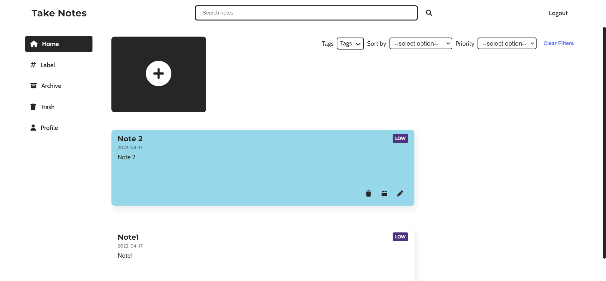
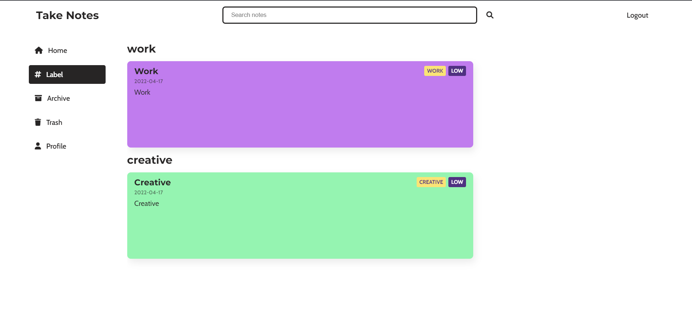
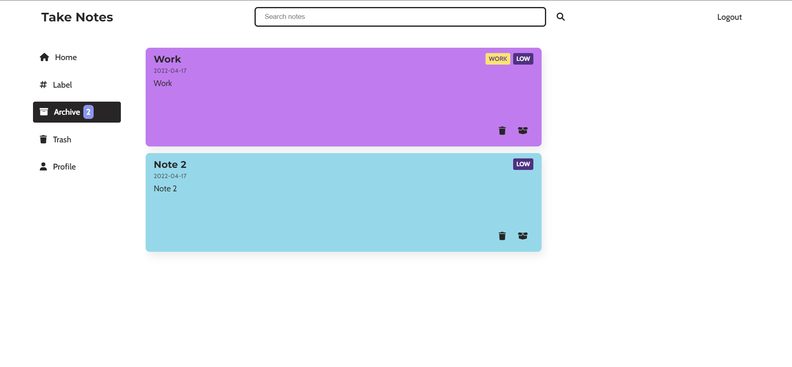
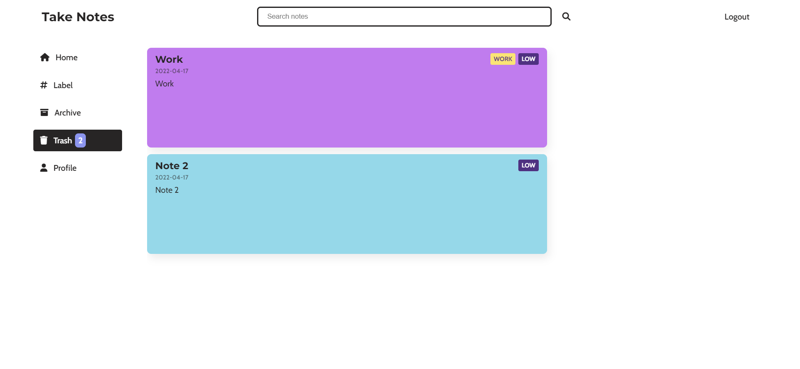

# Take Note

Take note is a note taking app with various functionalities, including colored cards, labels, editing, deleting and archiving the notes.

## Pages:

- [Homepage](https://spontaneous-eclair-62d02b.netlify.app/)
- [LabelPage]()
- [ArchivePage]()
- [Login]()
- [Signup]()

---

## Screenshots

Homepage:

Label:

Archive:

Delete:

